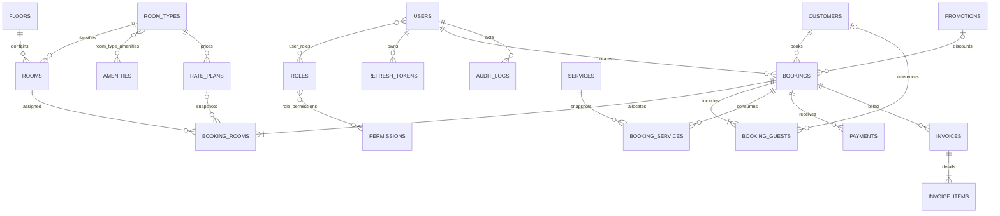

# GrandStay HMS — Thiết kế cơ sở dữ liệu (Bước 1)

## 1. Quyết định kiến trúc

- PostgreSQL là nguồn sự thật duy nhất cho đặt phòng và thanh toán. Mọi thời điểm được lưu bằng `timestamptz` theo UTC; múi giờ `Asia/Ho_Chi_Minh` chỉ dùng khi hiển thị.
- Khóa chính dùng UUID sinh bởi `gen_random_uuid()` để tránh phụ thuộc trình tự và thuận lợi khi tích hợp.
- Tiền tệ dùng `numeric(19,2)`, không dùng số thực. Mã tiền tệ dùng ISO 4217, mặc định `VND`.
- `bookings` không chứa `room_id`. Quan hệ nhiều-nhiều được biểu diễn qua `booking_rooms`; giá phòng và khoảng lưu trú được snapshot tại đây.
- `BOOKED` và `OCCUPIED` không tồn tại trong trạng thái vận hành của `rooms`. Trạng thái hiển thị được suy ra từ `booking_rooms.allocation_status` cùng `rooms.operational_status`.
- Để PostgreSQL có thể áp dụng exclusion constraint trên từng phòng, `booking_rooms` giữ bản sao trạng thái phân bổ. Trigger khóa bản ghi booking cha và tự đồng bộ trường này; ứng dụng không được tự quyết định giá trị đó.
- Booking, payment và invoice không có API xóa cứng. Dữ liệu danh mục dùng `deleted_at` khi phù hợp. Các bảng giao dịch dùng optimistic locking qua `version`.
- Thông tin CCCD/hộ chiếu không được ghi log. Cột định danh được thiết kế để mã hóa ở application layer trước khi lưu; hash dùng cho tìm kiếm trùng chính xác mà không giải mã hàng loạt.

## 2. Giả định nghiệp vụ

- Khoảng lưu trú là nửa mở `[check_in_at, check_out_at)`: khách trả phòng đúng lúc khách tiếp theo nhận phòng không bị xem là trùng.
- Chỉ `CONFIRMED` và `CHECKED_IN` giữ chỗ. `PENDING`, `CANCELLED`, `CHECKED_OUT` và `NO_SHOW` không tham gia exclusion constraint.
- Một booking có một khoảng thời gian dự kiến chung, nhưng mỗi `booking_room` snapshot lại khoảng đó để hỗ trợ đổi/phân phòng và kiểm soát trùng chính xác.
- Giá phòng snapshot gồm đơn giá, kiểu tính (`HOURLY`, `DAILY`, `NIGHTLY`) và thuế suất. Giá dịch vụ cũng được snapshot khi thêm vào booking.
- Tiền cọc là một payment có `purpose = DEPOSIT`; hóa đơn không tự trừ cọc. Số dư phải thu được tính từ tổng hóa đơn trừ tổng payment đã hoàn tất, sau khi tính refund.
- Khách chính được bảo đảm bằng unique index có điều kiện: tối đa một primary guest trên mỗi booking.
- Mỗi tầng thuộc hệ thống hiện tại; thiết kế sẵn `code` duy nhất để có thể mở rộng thêm cơ sở khách sạn mà không đổi API hiển thị.

## 3. ERD



## 4. Trách nhiệm từng bảng

| Nhóm | Bảng | Trách nhiệm |
|---|---|---|
| Phân quyền | `users`, `user_avatars`, `roles`, `permissions`, `user_roles`, `role_permissions` | Tài khoản, ảnh đại diện, RBAC và liên kết quyền; mật khẩu chỉ lưu BCrypt hash, Google dùng `google_subject` duy nhất. |
| Phiên | `refresh_tokens` | Chỉ lưu SHA-256 hash của refresh token, rotation family, thời điểm hết hạn/thu hồi. |
| Khách | `customers` | Hồ sơ khách có thể tái sử dụng; định danh nhạy cảm lưu ciphertext và blind hash. |
| Phòng | `floors`, `room_types`, `rooms`, `amenities`, `room_type_amenities`, `rate_plans` | Danh mục phòng, tiện nghi và chính sách giá. |
| Đặt phòng | `bookings`, `booking_rooms`, `booking_guests` | Booking cha, phân phòng/giá snapshot và danh sách khách snapshot. |
| Dịch vụ | `services`, `booking_services` | Danh mục dịch vụ và lần sử dụng với giá snapshot. |
| Khuyến mãi | `promotions` | Thời gian hiệu lực, kiểu và giá trị giảm; booking giữ số tiền giảm cuối cùng. |
| Thanh toán | `payments` | Nhiều giao dịch/cọc/refund trên một booking; refund tham chiếu giao dịch gốc. |
| Hóa đơn | `invoices`, `invoice_items` | Snapshot hóa đơn và các dòng tiền phòng/dịch vụ/phụ phí/giảm giá/thuế. |
| Truy vết | `audit_logs` | Metadata thay đổi không chứa bí mật hoặc dữ liệu định danh nhạy cảm. |

## 5. Chống trùng lịch

`booking_rooms_no_overlap` dùng GiST trên `(room_id WITH =, stay_period WITH &&)` và chỉ áp dụng khi trạng thái là `CONFIRMED` hoặc `CHECKED_IN`. Trigger `trg_booking_rooms_sync_status` lấy trạng thái từ booking cha trước khi ghi. Trigger `trg_bookings_propagate_status` cập nhật toàn bộ phân phòng khi booking đổi trạng thái; nếu phát sinh trùng, transaction bị rollback. Application layer vẫn phải query kiểm tra trước để trả lỗi thân thiện, nhưng database là hàng rào cuối cùng chống race condition.

## 6. File triển khai

- `grandstay-backend/src/main/resources/db/migration/V1__initial_schema.sql`: extensions, schema đầy đủ, khóa ngoại, check/unique/index, trigger và exclusion constraint.
- `docs/database-smoke-test.sql`: kiểm tra trigger đồng bộ và chứng minh booking hoạt động bị chặn khi trùng phòng.

## 7. Chạy và kiểm thử migration

Từ thư mục gốc, có thể kiểm thử độc lập bằng PostgreSQL Docker:

```powershell
docker run --name grandstay-db-check -e POSTGRES_PASSWORD=postgres -e POSTGRES_DB=grandstay -p 55432:5432 -d postgres:17-alpine
docker cp .\grandstay-backend\src\main\resources\db\migration\V1__initial_schema.sql grandstay-db-check:/tmp/V1.sql
docker exec grandstay-db-check psql -v ON_ERROR_STOP=1 -U postgres -d grandstay -f /tmp/V1.sql
docker cp .\docs\database-smoke-test.sql grandstay-db-check:/tmp/database-smoke-test.sql
docker exec grandstay-db-check psql -v ON_ERROR_STOP=1 -U postgres -d grandstay -f /tmp/database-smoke-test.sql
docker exec grandstay-db-check psql -U postgres -d grandstay -c "SELECT tablename FROM pg_tables WHERE schemaname='public' ORDER BY tablename;"
```

Container kiểm thử có thể xóa sau khi xác nhận bằng `docker rm -f grandstay-db-check`.
